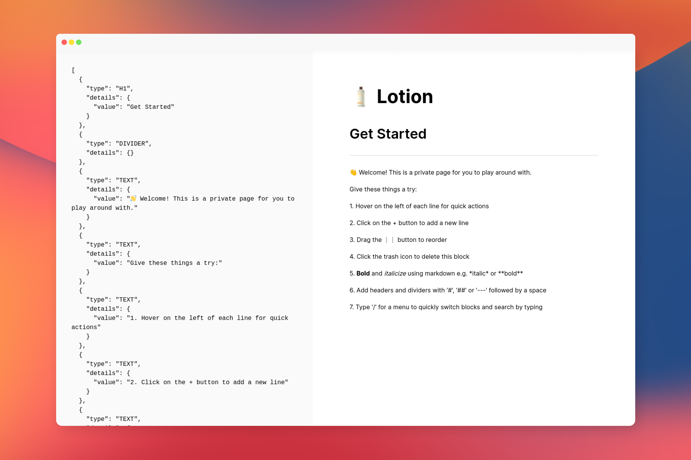

<h1 align="center"><b>🧴 Lotion</b></h1>
<p align="center">
  An open-source Notion UI built with Vue 3
</p>
<p align="center">
  <a href="https://twitter.com/dashibase">
    
  </a>
  <a href="https://discord.gg/CqgZGh4ZA8">
    
  </a>
  
  <br />
</p>

> We will be talking about Lotion and the Notion UI during [CityJS Singapore's pre-conference meetup on 27th July](https://www.meetup.com/Singapore-JS/events/287321415/)!

<p align="center">
  
</p>

## Features

- [x] Block-based editor
- [x] Drag to reorder blocks
- [x] Basic Markdown-parsing including bold, italic, headings and divider
- [x] Type '/' for command menu and shortcuts

## Getting Started

**1. Clone this repository, go to the root directory and install packages**

```bash
git clone https://github.com/dashibase/dashibase-insert
cd dashibase-insert
npm i
```

**2. Run dev**

```bash
npm run dev
```

You should see what looks like the screenshot about.

**3. Contribute!**

Lotion is quite limited for now but we hope it serves as a good starting point for other folks looking to build their own editors.

We would love to make Lotion more extensible and welcome any suggestions or contributions! 
